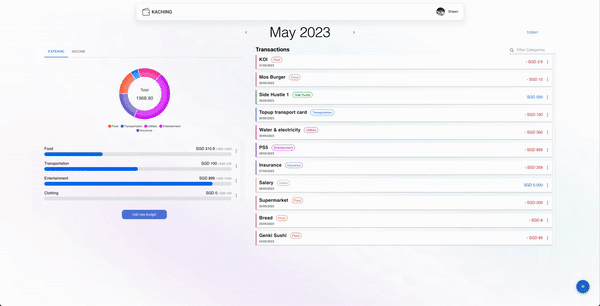

# goWhere

<p align="center">
    
    
</p>
A personal finance tracker to track monthly expenses and budgets based on day, month or year.
_Project 3 for Rocket Academy Bootcamp_

### Preview



## Features

- Allowing users to login/signup, with the help of [Auth0](https://auth0.com/)
- Add, edit, and delete transactions/budgets/categories created by user
- Dashboard available to track year to date expenses or income
  - Also includes line chart, tree map to see monthly expenditure and income, as well as most spent category

## Tech Used

- Front end: [React](https://react.dev/)
- Routing: [React Router](https://reactrouter.com/en/main)
- UI: [Material-UI](https://mui.com/), [NextUI](https://nextui.org/)
- Storage: [Firebase](https://firebase.google.com/)
- Backend: [Node.js](https://nodejs.org/en), [Express.js](https://expressjs.com/), [Sequelize](https://sequelize.org/)
- Database: [PostgreSQL](https://www.postgresql.org/)

## Setup

**Pre-requisite: Need to have [kaching-backend]() in order to run the full application. Guides on setting up the backend will be shown in that repository.**

This project is created using create-react-app. Before starting, it is required to run the following steps for the application to work

1. Clone repo to local

2. Configure `.env` file, make sure to get your own API keys stated below and insert it into your `.env` file
   - If unsure where to get API keys, refer to the Tech Used for the documents

```
REACT_APP_DOMAIN = <Insert Auth0 domain>
REACT_APP_CLIENTID = <Insert Auth0 clientId>
REACT_APP_AUDIENCE = <Insert Auth0 audeience url>
REACT_APP_FIREBASE_API = <Insert Firebase API key>
```

3. Install all dependencies required in this repo, and run locally

```
npm i
npm start
```

4. Enjoy!

## Future improvements

- Set proper task scheduling to send email/notification to user as a reminder to pay their bills.
- Sorting and filtering functions on transactions in the home page
- Allow user to check other yearly transactions, current limitation on for current year
- Mobile view
- Change Auth0 email when user changes email

## Contributors

- [Me, Shawn Goh](https://github.com/shawn-goh24)
